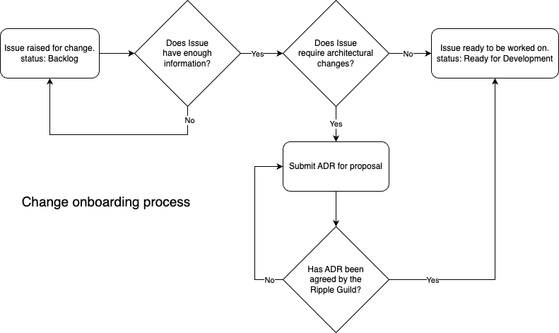
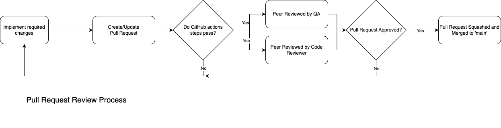

# Contributing

If you would like to contribute code to this project you can do so through GitHub by forking the repository and sending a pull request. Before RDK accepts your code into the project you must sign the RDK Contributor License Agreement (CLA).

# Introduction

This guide serves to define the framework of governance used to manage the Ripple code base.

Please make sure to read the [README](README.md) before contributing to the project.

# Glossary

ADR - Architectural Decision Record

PR - Pull Request

# Useful Links

Ripple project board: [https://github.com/orgs/rdkcentral/projects/11](https://github.com/orgs/rdkcentral/projects/11)

Ripple ADRs: [https://github.com/rdkcentral/Ripple/tree/main/docs/adr](https://github.com/rdkcentral/Ripple/tree/main/docs/adr)

# Ripple Guild

The Ripple guild is the group of engineers responsible for the implementation and management of the Ripple project. The purpose of this Guild is to ensure that the direction, functionality and implementation of Ripple are in line with the project's overall goals and the requirements of it's stakeholders. This group has representatives from all organisations which have a stake in the development and delivery of the Ripple platform.

The current members of the Ripple Guild are:

- Sathishkumar Deena Kirupakaran [@satlead](https://github.com/satlead)
- Vinod Sathyaseelan [@Vinodsathyaseelan](https://github.com/Vinodsathyaseelan)
- Kevin Shah [@kevinshahfws](https://github.com/kevinshahfws)
- Josekutty Kuriakose [@joseinweb](https://github.com/joseinweb)
- Adam Cox [@adamdama](https://github.com/adamdama)

The Ripple's Guilds main responsibilities are:

- Represent the priorities of their organisation
- Arrange resources to deliver on their organisation's needs
- Manage group of approved reviewers
- Create releases
- Triaging of GitHub Issues
- Plan Development Iterations
- Ensure contributions meet the functional and system/environmental requirements of Ripple

The guild is not responsible for all architectural design and decision making. Where significant architectural decisions are needed guidance and direction will be sought from the Architecture Review board present at Comcast.

# Onboarding Changes

When the need for a change has been identified an Issue for it needs to be raised in the GitHub project. This can be achieved by going here: [https://github.com/rdkcentral/Ripple/issues](https://github.com/rdkcentral/Ripple/issues) and clicking on the New Issue button. Submitted Issues should described the problem, new feature or idea and have sufficient detail that it can be assessed by the Ripple Guild. If possible, the potential solution or in the case of a defect the conducted analysis, should also be provided.

Raised Issues are automatically added to backlog by setting their status to "Backlog". These issues are have not been triaged and are not yet ready to be worked on. In order to progress these issues they must first be categorised as either "fits within existing architecture" or "needs architectural changes". This categorisation will be established in a bi-weekly meeting of the Ripple Guild. The result of categorisation will be assigned as a label on the Issue.

Changes which are categorised as "fits within existing architecture" do not require labelling and can be started without any architectural design needed. These can be prioritised straight away and work can start as needed. These issues should have links to appropriate documentation or existing example code added to them. These issues can have their status set to "Ready for Development".

Changes which are categorised as "needs architectural changes" should be labelled with "architecture needed" and will need to go through a process of architecture proposal and review. The status of these Issue's should be set to "". Proposals should be captured as an ADR (see ADR section below) in the repository and discussions started with the architects assigned to the project. Once the architecture for the change has been agreed between the architects and lead engineers the outcome should be captured in the ADR. This ADR should then be linked to from the open issue and the "architecture needed" label can be removed and the state can be set to "Ready for Development".

As an Open Source project contributions from the community are of course encouraged. If contributions are submitted that comprise of either new architecture or significant changes to existing architecture then these changes should be accompanied by an ADR that details the proposed changes, their ramifications and their benefits. Contributions are welcome either as an ADR only or an ADR with accompanying code.

A diagram of the described process can be seen below:



# ADRs

Architectural Decision Records serve to stand as a record of decisions that have been made in the project with regards to code architecture. These documents capture the problem, options, selected solution and justifications for all significant changes in the code base. These documents are the product of proposals from the Ripple Guild, the Architectural Review Board or submissions directly from community members. Where appropriate ADRs should contain details on how to implement the solution in the Ripple codebase.

The ADR files must be written as Markdown formatted text files and stored in the docs/adr directory in the project repository. [https://github.com/rdkcentral/Ripple/tree/main/docs/adr](https://github.com/rdkcentral/Ripple/tree/main/docs/adr)

When submitting an ADR it is encouraged to provide some implementation of the proposed approach. The provided code should indicate how you intend for the proposal to be implemented which will give the reviewers better context when assessing the ADR. This implementation does not have to be complete but it cannot affect the current operation of the system. If the ADR is accepted and the implementation is only partial then the remaining work that needs to be completed to deliver the functionality must be created as Issues in the project.

Each ADR must have a status field at the top which highlights where we are with the implementation. These statuses are:

| Status         | Definition                                                                                                                                         |
| -------------- | -------------------------------------------------------------------------------------------------------------------------------------------------- |
| Proposed       | The ADR is under proposal and no decision has been made about which option to go with. There is little to no code provided for any of the options. |
| Implementation | A decision has been made about which option to chose and the implementation has been partially completed.                                          |
| Complete       | The decision about which option to go with has been made and justifications have been recorded. The implementation is complete.                    |

An example of an ADR being accompanied by the code changes to implement the proposal can be found in the PR here: [https://github.com/rdkcentral/Ripple/pull/208](https://github.com/rdkcentral/Ripple/pull/208)

To read more about ADRs in general see: [https://cognitect.com/blog/2011/11/15/documenting-architecture-decisions](https://cognitect.com/blog/2011/11/15/documenting-architecture-decisions)

# Development Iterations

Development on the Ripple project is being delivered in two week iterations. These iterations are planned by the Ripple Guild during a planning session undertaken once every 2 weeks. Planning sessions entail completing the following tasks:

- Triage of any new Issues
- Prioritisation of all existing Issues
- Assessment of currently planned Iterations
- Assessment of available resource for next Iteration
- Assignment of Issues to the next unplanned Iteration

Best efforts are made to ensure that two iterations ahead of the one in progress are populated.

The current and upcoming iterations can be seen on the project board here: [https://github.com/orgs/rdkcentral/projects/11](https://github.com/orgs/rdkcentral/projects/11)

# Releases

Ripple releases are managed separately to the development iterations. Unless no changes have been contributed during an iteration then one or more releases will be created during an iteration. A release will either be made when a need has been identified for a newly merged feature or fix, or at the end of the iteration when all ongoing work for that iteration has been completed. Releases are created by a member of the Ripple Guild. Releases are always made from the main branch and a tag is created from the latest commit at the time of release. This tag is in the format ripple-0.0.0. This tag represents the canonical state of the code that represents the release of the named version and allows users to checkout and build any specific version. The tag is used to create a GitHub Release which documents the supported Firebolt version and changelog of what was added in the release.

Releases can be found here: [https://github.com/rdkcentral/Ripple/releases](https://github.com/rdkcentral/Ripple/releases)

## Versioning

Ripple releases follow the semantic versioning scheme: [https://semver.org/](https://semver.org/)

Each release involves increasing the version number according to the changed included in the new version.

1.  MAJOR version when you make incompatible API changes
2.  MINOR version when you add functionality in a backward compatible manner
3.  PATCH version when you make backward compatible bug fixes

# Pull Requests

All contributions that need to be included in the codebase for Ripple should be submitted as Pull Requests on the GitHub repo. If the contributor is part of the rdkcentral org then the merging branch can be hosted on the repository itself. If the contributor is not a part of the org then the Ripple repo must first be forked to host the new branch and the PR can be submitted from the fork.

The description on the PR should follow the project's PR template and explain what the code charges are and what need they are addressing. Any GitHub Issues which are addressed by the submitted changes should be linked to the PR and the description must explain how this PR is solving the issue or make it clear when more changes are needed for the issue to be fully addressed.

All pull requests must pass a series of checks to ensure the quality and correctness of the the code. These checks cover running the unit and integration tests, checking the code formatting, ensuring the code licenses are appropriate and running linting tools to check for common mistakes or potential improvements. All checks must pass in order for the code reviewed.

The newly submitted code must not reduce the current code coverage of the tests on the project. If the existing code coverage measurement is reduced by the submission then the pull request will be rejected. In this case coverage must be increased before the build checks will pass.

The code must be peer reviewed by two people, one from a code perspective and one from a test/QA perspective. The code review will be performed by a member from the pre-approved reviewers group. The members of this group are determined by the Ripple Guild. As well as reviewing the code in the PR, this reviewer is responsible for ensuring that the PR has the correct labels and Issues links. The test review will be from a member of one of the Comcast QA teams working on Ripple as they are currently best placed to be able to run the full suite of tests needed to ensure everything is working correctly. If these tests fail the QA reviewer will. These test suites will ensure that all changes build correctly for the currently supported devices and there are no regressions in the certification test suite. An approach for moving this testing capability into the Open Source project is under review.

Only once the PR has passed all automated checks and approved by both reviewers can the code be accepted and merged into the main branch. Once the change is in the main branch it will be a part of the next release.



# Development Environment

To get started working on Ripple a contributor will need to setup a local development environment.

## Rust

The first step here is to get a Rust development environment:

- Rust

  - the programming language, std library and compiler can be installed using rustup and following the instructions here: [https://www.rust-lang.org/tools/install](https://www.rust-lang.org/tools/install)
  - alternatively you can use brew on mac and install with:

```sh
brew install rustup-init
rustup-init
```

- Follow the install instructions. Make sure you update your shell init scripts to include sourcing the cargo env file.

- Cargo

  - Rust package manager, build tooling and task runner
  - This should have been installed when you installed Rust via rustup

- rustfmt

  - The Rust code formatting tool: [https://github.com/rust-lang/rustfmt](https://github.com/rust-lang/rustfmt)
  - It may already have been installed when using rustup-init. If not, it can be installed by running:
    ```sh
    rustup component add rustfmt
    ```

- clippy

  - The Rust code linting tool: [https://github.com/rust-lang/rust-clippy](https://github.com/rust-lang/rust-clippy)
  - It may already have been installed when using rustup-init. If not, it can be installed by running:
    ```sh
    rustup component add clippy
    ```

- VS Code and rust-analyzer

  - [https://rust-analyzer.github.io/](https://rust-analyzer.github.io/)
  - rust-analyzer also supports Vim
  - or another IDE if you prefer, the IntelliJ platform and Rust plugin is a popular choice

Ripple can be developed using Rust 1.68 or higher. However the project must be compilable on Rust 1.58 until some of the build pipelines using Ripple have been updated.

## Ripple Development

Once you have a Rust dev environment up and running you can start writing code for Ripple contributions. There are a set of steps described in the project's [README](https://github.com/rdkcentral/Ripple#how-to-run-ripple-locally) that should be followed to get Ripple built and running locally. Currently development requires having a hardware device (such as Raspberry Pi) to run RDK and point Ripple at. Without a device, code can be written and tested in unit and integration tests but you will not be able to run Ripple and manually verify your work, unless you use some kind of mock service which the Ripple project does not provide. There is currently an open Issue to address this and provide contributors with a mock device Ripple extension, which will support development and testing without a device. This work is underway however it is not yet complete ([Issue](https://github.com/rdkcentral/Ripple/issues/34)).

Development with a real hardware device can be achieved by running ripple locally and pointing to the device on the local network. To do this run the following command:

```sh
ripple run 192.168.0.95 # where 192.168.0.95 is the IP of the device on the local network.
```

This will build the most recent changes and start ripple connected to your device.

## Logging

Ripple uses the fern crate for logging. If you want logs to print when running ripple locally please ensure that you have the RUSTLOG environment variable set. For example:

```sh
RUSTLOG=debug # other options are trace, info, warn, error
```

# Contribution Guidelines

## Code Style

The Open Source Ripple repository is using rustfmt for code formatting and clippy for code linting. These are being enforced both in git pre-commit hooks during local development and in the GitHub actions which run on every pull request.

## Conventional commits

It is encouraged for all commits to use the conventional commit messages. The benefits of conventional commits can be read about [here](https://www.conventionalcommits.org/en/v1.0.0-beta.2/#why-use-conventional-commits). This is not currently enforced but it may be at some point in the future ([Issue](https://github.com/rdkcentral/Ripple/issues/236)).

## Testing

All contributions should be delivered with unit test cases to cover the changes. These unit tests should be enough to ensure that what has been submitted works and protect from future regressions. The test cases should cover both success (happy) and failure (unhappy) paths in the new/changed code.

In addition to unit tests, integration tests to check new/changed paths through the application should be added to the tests/ folder in the project root. These tests must be able to run in the CI environment and should not rely on any external dependencies. It is possible that these tests might rely on the mock device extension in order to be achieved.

Contributors should manually test their changes as well in order to confirm that the test cases that have been written match the reality of running the code.

~Code coverage is captured by automated tooling during the CI process. The coverage of a branch is checked against the coverage on the main branch and pull requests that reduce coverage will be rejected. For the convenience of developers a pre-push hook is has been setup that will check the coverage of the current branch locally.~

## Documentation

All contributions to Ripple that add new or change existing functionality must update the appropriate documentation. Documentation for the project can be found in the docs folder in the repository root. Doc contributions must always be submitted as Markdown files.

# Build process

Ripple project can be built using the cargo build command for the target of your choice. In some cases you might need to use cross instead of cargo. Please refer to the cross documentation if you are unable to cross compile for your target platform: [https://github.com/cross-rs/cross](https://github.com/cross-rs/cross)

Ripple is only tested for running on on ARMv7 machines and developer laptops.

To build for your local machine run:

```sh
cargo build --release
```

TODO: further elaborate on the build process with examples of how this can be done using docker for ARMv7
