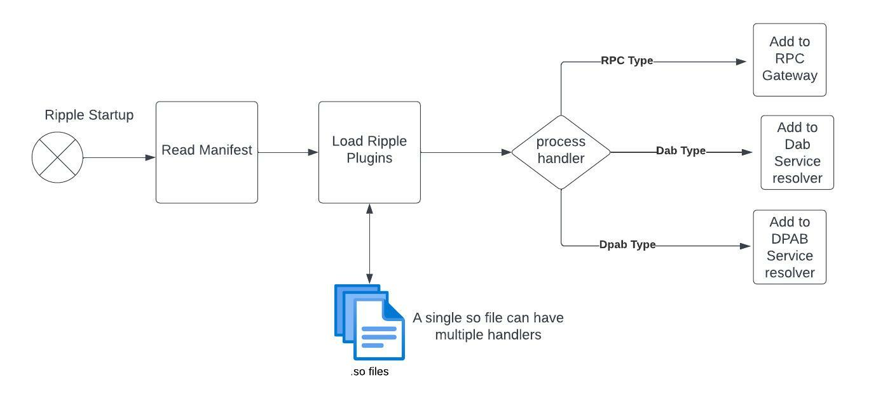
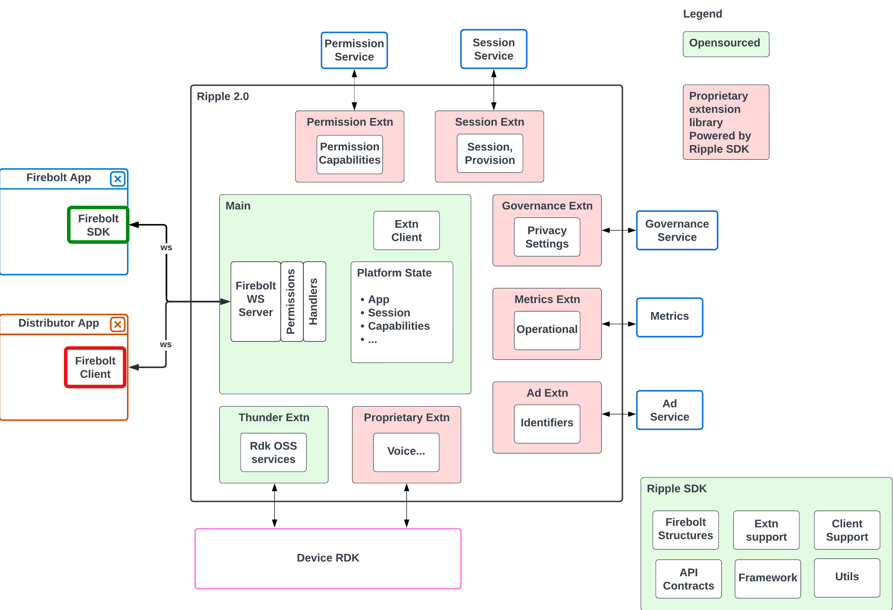

# Ripple

Ripple is a synonym for Firebolt Implementation, it is a Rust based Application gateway which supports loading dynamic extensions. Ripple will provide a Firebolt Gateway which will be used by Distributors and App Developers to interact with the Application platform to discover, launch and manage video streaming applications.
> let's ripple better

## Why Rust?
Rust is a systems programming language that offers the performance and small footprint of C with the abstractions of a higher level language.
The package manager is similar to the ease-of-use found in NodeJS's npm or yarn systems.
It ships with a build system. Because of this, it is possible to produce a binary that will run on an Arm v7 processor. This makes it easy to demonstrate native code running on real hardware.
The compiler keeps developers out of trouble. Especially helpful for new systems programmers in that it eliminates entire classes of bugs that exist in languages like C/C++.

## Setup

### Manifests
Before we run Ripple we need to take a moment to understand the manifest files used in Ripple.

There are 3 Manifest files which are necessary for Ripple 2.0.
1. `Device Manifest` : Contains configurations, capabilities and link for the app libraries. Device Manifest complies to the Open RPC schema detailed in the [Firebolt configuration repo](https://github.com/rdkcentral/firebolt-configuration). An example for the device manifest can be found in `examples/manifest/device-manifest-example.json`
2. `Extension Manifest` : Contains the path of the extensions, contracts used and fulfilled by each extension. An example of the extn manifest can be found in `examples/manifest/extn-manifest-example.json`.
3. `App Library`: Contains the App catalogue denoting the App Launch Url and configurations required by Ripple for launching and management. An example can be found in `examples/manifest/app-library-example.json`.


### Pre-requisites for running with VSCode
1. Install [Rust](https://www.rust-lang.org/tools/install)
2. Install [VSCode](https://code.visualstudio.com/)
3. Install [Rust Analyzer](https://marketplace.visualstudio.com/items?itemName=rust-lang.rust-analyzer) from VS Code Marketplace
4. Install [Crates](https://marketplace.visualstudio.com/items?itemName=serayuzgur.crates) VSCode extension (Optional)

## How to run Ripple locally?

1. Initialise the repository submodules
  > git submodule update --init --recursive
2. Before running this command if you already have a `~/.ripple` folder take backup.
  > ./ripple init
3. Check the `~/.ripple/firebolt-extn-manifest.json`
  The __*default_path*__ setting should point to the `target/debug` directory under your Ripple project folder
  ```json
    "default_path": "[Path to your workspace]/ripple-workspace/target/debug/",
  ```
  Check the __*default_extension*__. The value should be `dylib` for mac, `dll` for windows and for unix it will `so`.
  ```json
    "default_extension": "dylib",
  ```
4. Check the Device Manifest file `~/.ripple/firebolt-device-manifest.json`
  Check  __*library*__ value points to the `firebolt-app-library.json` file in your `.ripple` directory.
  ```json
    "library": "~/.ripple/firebolt-app-library.json",
  ```
5. Open the App library file `~/.ripple/firebolt-app-library.json`
  Add the below parameter to the `start_page` in the app library. Replace [app_id] with actual app id and [RIPPLE_IP_ADDR] with the IP address where ripple is running
  ```
  __firebolt_endpoint=ws%3A%2F%2F[RIPPLE_IP_ADDR]%3A3473%3FappId%3D[app_id]%26session%3D[app_id]
  ```

  For e.g. for refui of firebolt cert app
  ```json
    "default_library": [
        {
          "app_id": "refui",
          ....
          "start_page": "https://firecertapp.firecert.comcast.com/prod/index.html?systemui=true&__firebolt_endpoint=ws%3A%2F%2F10.0.0.107%3A3474%3FappId%3Drefui%26session%3Drefui&systemui=true",
  ```

6. Find the ip address of the device which is connected to the same network router as the machine running Ripple.
  > ripple run {ip address of the device}

Note: Device should be accessible bothways between the machine which is running ripple and target device.

### Debugging using VSCode

Only follow the below steps, if all the above instructions to run the app locally were successfully executed.

1. Install LLVM Debugger from the VS Code Marketplace. [CodeLLDB](https://marketplace.visualstudio.com/items?itemName=vadimcn.vscode-lldb) is recommended.
2. Open `main.rs` in `core/main/`
3. Set some breakpoints in code.
4. Upon clicking on the main method in the file. There would be an option to `Run` or `Debug`. Select Debug.
5. VSCode will pause at the breakpoint and allows access for Debug Playback and ability to inspect the values.


## Unit test coverage/gating
Unit test coverage (determined by `cargo-llvm-cov`) is run for every push to the head repo. It is reccomended that coverage is run before every push to the head.
To get current unit test coverate on a local branch:
`./coverage.sh`


## Clippy (linting)
`clippy` (the opinionated de-facto rust linter) is used as a linter in CI. It is reccomended that clippy is run before every push to the head repo.
To run clippy:
`./run-clippy.sh`


### Using Clippy in VSCode

By default the VSCode rust-analyzer extension runs cargo check on the Rust files that you have open once they have been saved. This is good, but it can be improved by adjusting the command to use `clippy` instead. This gives you the benefit of seeing both `cargo check` and `cargo clippy` results and code hints in the code editor window directly.

To achieve this you need to add the following to your user-settings.json file.
```json
  "rust-analyzer.check.command": "clippy",
```

### pre-commit

This repository uses pre-commit to ensure that committed code is checked and formatted correctly. To set this up in your development environment please:
1. Install pre-commit

on macOS:
```bash
brew install pre-commit
```

elsewhere:
```bash
pip install pre-commit
```

2. Install the hooks for this repository:
```bash
pre-commit install
```

See: https://pre-commit.com/

## Folder structure

Ripple folder structure has the below layers

#### Core folder
This folder contains the workspaces for 
1. `sdk` - Contains the building block for all ripple components. More info here.
2. `main` - Ripple main starter application loads the extensions, starts the gateway and its services.
3. `launcher`- Contains the Launcher code extension which uses Thunder RDKShell API for launching apps. Ripple can run without this extension for external launchers.

#### Examples folder
This folder contains the workspaces which solves usecase with actual examples
1. `rpc_extn` - Provides an example of how a firebolt method can be made into an extension using the sdk. This would be applicable for both Proprietary and Device specific extensions.


### What is Ripple magic sauce?

Loads shared libraries during Ripple Startup using extension manifest and provides extensibility.



Lets apply this to an actual Ripple 2.0 runtime which has loaded the below plugins
1. `device/thunder`: This starts the thunder thread and accepts Device Requests. It also accepts Device extentions which assist in proprietary thunder plugins and device specific thunder extensions.
2. `distributor/general`: This starts a thread to service Distributor specific contracts like Privacy, Advertising, Session etc.
2. `examples/rpc_extn`: This provides 2 extensions one for externalizing Non Firebolt Api which can be proprietary in nature.

Breakdown the big Ripple monolith into smaller runtime extensions using a standardized SDK.


## Further Reading

[How-to](./docs/how-to.md)
# Test change for pre-push hook demo
