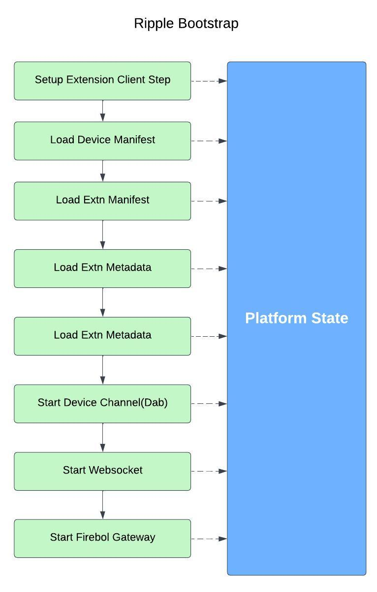

# Bootstrap

Ripple 1.0 has a pure asynchronous startup so handling errors and orchestrating was challenging.

Ripple 2.0 follows a better `Bootstrap` using the `sdk` above diagram explains the startup process for `Main` application.

For latest Firebolt spec (Firebolt JSON-RPC API, version: "1.3.0") refer the following link:
(https://rdkcentral.github.io/firebolt/requirements/latest/specifications/firebolt-open-rpc.json)

If local_dev feature enabled:
Ripple refer the firebolt-open-rpc.json file location updated via Environment variable(path : ${workspace_dir}/target/openrpc/firebolt-open-rpc.json).
Else refer the location updated by the build system(path : "/etc/ripple/openrpc/firebolt-open-rpc.json").

