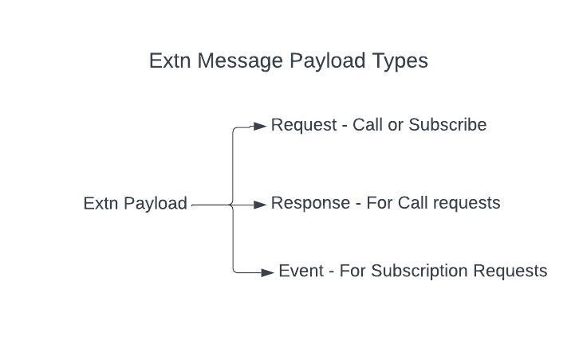

# Extension Client
Extension client is at the heart of the Ripple architecture by providing a reliable and easy to use Inter Extension communication. During the course of the document the usage of the term `Client` will be a synonym to the Extn Client. Similarly term `Main` means the `Ripple Main` application which exists in `core/main`.

## Glossary
__*FFI*__ - [Foreign Functional Interface](https://en.wikipedia.org/wiki/Foreign_function_interface) is the mechanism used for dynamic link library.

__*ABI*__ - [Application Binary Interface](https://en.wikipedia.org/wiki/Application_binary_interface) is the interface between the dynamic link library and the loader

__*Crossbeam Channel*__ - [Rust library](https://docs.rs/crossbeam/latest/crossbeam/channel/index.html) which provides channels that can work across the loader and the dynamic link libraries.

__*Extension*__ - Ripple Dynamic link library which can be loaded during runtime and offer more extensive capabilities. 

## Overview
Core objective for the Extn client is to provide a reliable and robust communication channel between the  `Main` and its extensions. There are challenges when using Dynamic Linked libraries which needs to be carefully handled for memory, security and reliability. `Client` is built into the `core/sdk` for a better Software Delivery and Operational(SDO) performance.

Lets look a little deeper into the `Client`

### Inter Extension Communication(IEC)

Above image is a zoomed out view of Extn clients are connected between the `Main` and couple of extensions. So there are 3 components in this above image

a. `Main Application` - This is the `core/main` application which is the loader and also the entry point to the Ripple application

b. `Device Channel Extension` - Device channel which maintains a state of persistent connection with the underlying Device Interface.

c `Some Other Extension` - Either a proprietary or a device specific extension which resides outside the main application and loaded as a Dynamic Link Library

#### All roads lead to Ripple Main
Visible similarity between `a`, `b` and `c` is that they all get an instance of the `Client` and they are connected to `a` and not to each other directly. This is a really important detail for `enforcing security and standardizing the communication` across extensions. Every request goes through to the `Main` application for validation and forwarding. Once the validations are successful Main redirects the request to the intended Extn.


Above image is a very good example of how `Main` rejects any requests from `c` if it does not have the permission for that capability.

#### Response needs no stopovers
`Main` checks for permissions for any given request coming from an extension using [Extn Capabilities](./capabilities.md). Given the security and standardization criteria are already met `Main` adds a callback to the request before forwarding to the Request Processor in another extension. The Request processor can now directly respond back to the original caller without hopping back to Main


### Crossbeam Channel
Crossbeam provides a safe FFI bridge between Extensions and `Main` any communication between `Client` happens on this channel. It uses MPMC which expands to Multiple Producer and Multiple Consumer model. 

Each extension `Client` gets a Sender to call `Main` with requests. It also uses this same sender to send back the response if there is no callback supplied for a given request.

`Client` also gets a receiver which is used for Message processing. Implementation sections covers the reciver in a bit more detail.

### Extn Message

Extn Message provides the API content structure for the client. In simpler terms if `Client` is the speaker then `Message` is the language. Message for Client is heavily  structured in a way to handle crossing FFI boundary between extensions. Here is the structure of a ExtnMessage

```
pub struct ExtnMessage {
    pub id: String,
    pub requestor: ExtnCapability,
    pub target: ExtnCapability,
    pub payload: ExtnPayload,
    pub callback: Option<CSender<CExtnMessage>>,
}
```

Below table explains what each field means
| Field        | Type           | Note  |
| ------------- |-------------| -----|
| id     | String| Usually an UUID to identify a specific message |
| requestor      | ExtnCapability      | Looks something like `ripple:main:internal:rpc` when converted to String for a request coming from `Main`  |
| target | ExtnCapability      |    Something like `ripple:channel:device:info` for the device channel info request|
| payload| ExtnPayload| Payloads will be discussed in detail on the next section|
|callback|Crossbeam `Sender<CExtnMessage>` | Usually added by `Main` to the `target` to respond back to the `requestor`|

### Extn Payloads
There are 3 types of Extn Payloads

1. Request - Could be a Call request or a subscription request.
2. Response - Response for a Call Request.
3. Event - Object used by listeners of subscription request.



### Encoding/Decoding
For a given Message to travel between dynamic link libraries it needs to make sure that the data is ABI friendly. To achieve this feature ExtnClient has an encoder and decoder to pass the data safely and securely across crossbeam channels.

Extn client uses a C friendly Structure called CExtnMessage to safely convert the ExtnMessage object for FFI transport.
Each Extn client has a encoder and decoder for sending and receiving messages.


Above diagram explains how 2 clients are binded within a crossbeam channel using encoder and decoder this is the backbone for the Extn client.
## Implementation
`Client` contains a `Sender` and `Processors`. 

`Sender` responsibilities remain mainly to `encode` the ExtnMessage and pass it to the target.
`Processor` on the other hand handles more sophisticated operations depending on the type of the payload.


Above image explains the operations possible within Extn client.
For any processing of a given message there needs to be a processor.
Every client has built in support for processing requests, response and events. 
### Request Response Lifecycle

There are 3 stages for the Request and Response operation.

#### Registration
`Main` and the extensions are expected to create processors and add them to their clients. Each processor will have a unique capability. This capability is the used for identification phase of a request and response lifecycle. Any struct which wants to become a request processor should implement `ExtnRequestProcessor`. An example for the implementation is provided below
```
#[derive(Debug)]
pub struct SampleRequestProcessor {
    state: CloneableState,
    streamer: ExtnStreamer,
}

pub struct RequestValue{
    value: Value
}

impl ExtnPayloadProvider for RequestValue{
    #... snip
}

impl ExtnStreamProcessor for SampleRequestProcessor {
    type S = CloneableState;
    type V = RequestValue;
    fn get_state(&self) -> Self::S {
        self.state.clone()
    }

    fn sender(&self) -> MSender<ExtnMessage> {
        self.streamer.sender()
    }

    fn receiver(&mut self) -> MReceiver<ExtnMessage> {
        self.streamer.receiver()
    }
}

#[async_trait]
impl ExtnRequestProcessor for SampleRequestProcessor {
    async fn process_error(
        _state: Self::S,
        _msg: ExtnMessage,
        _error: ripple_sdk::utils::error::RippleError,
    ) -> Option<bool> {
            #... snip

    }

    async fn process_request(state: Self::S,
        msg: ExtnMessage,
        extracted_message: Self::V,
    ) -> Option<bool> {
            #... snip
    }


    client.addRequestProcessor(sampleRequestProcessor)

```

#### Identification
Client registers the processor based on the request value provided in the `ExtnStreamProcessor` trait. As this trait expects the `V` to be an `impl ExtnPayloadProvider` it will be able to get the `ExtnCapability` using the `ExtnPayloadProvider::cap()` method available in the trait.

Now the capability is registered in the client and it will be identified for any incoming messages.

#### Delegation

Below diagram explains the a simple usecase where `Main` calls an `Extension` for a response.


1. Caller provides the `ExtnPayload` this payload has to implement `ExtnPayloadProvider` provided in the `core/sdk`
2. Client finds the Crossbeam sender passes it down the `Sender` along with message.
2a. Client adds a Response processor using the `id` field in the message. This will be used for callback in step `10`.
3. `Sender` receives the request and adds the `requestor` field and sends the message to `Main`. In this step `Encoder` converts the `ExtnMessage` to `CExtnMessage`.
4. Target `Client` receives the request and decodes it back to `ExtnMessage` passes it down to the `Request` handler.
5. Client processors tries to find a matching capability within its processors and sends the message to Processor.
6. `Request` Processor handles the request and creates the `ExtnResponse` to be sent back to the `requestor`
7. Response reaches the `Client` of the target and it passes the message to the `Sender`
8. `Sender` encodes the response and sends it over the channel back to the requestor `Client`.
9. Requestor `Client` has now received back the response it decodes it and sends it to the `Response` handler.
10. Response handler uses the `id` field generated in step `2.a` and sends it to the response processor.
11. Callback in the response processor is executed and the response reaches back the caller.

##### Variation for Extn to Extn calls
There is a small variation when a call is made from an extension and the intended target is also an extension
1. `Client` receives the payload and forwards the request to `Sender`
1.a Client adds a Response processor using the `id` field in the message. This will be used for callback in step `10`.
2. `Sender` sends the request to `Main` Extn client.
3. `Client` receives the message in `Main` and checks for the requestor permissions. Once Permissions are satisfied it will check for the capability if it needs forwarding. If required it forwards the request to the Target extn client using `Crossbeam Sender` and adds a `callback`. This usecase is explained in the [Response needs no stopovers](#response-needs-no-stopovers) section.

Othersteps are same as the above usecase.

### Event Subscription Lifecycle
Event lifecycle is very similar to Request Response lifecycle. Only difference being the callback is not a one time operation but will be repeated multiple times based on the Event emission.


## Usage

For both Single and Subscription requests it is necessary to register an appropriate Request Processor as defined in this [step](#registration).

### Single Request Usage

Below snippet is an example of a sample request and response operation
```
 if let Ok(response) = client.request(DeviceInfoRequest::Make).await {
    if let Some(ExtnResponse::String(v)) = response.payload.clone().extract() {
        // Success receiving a String response from the payload
    } else {
        // Error
    }
```

To unpack this above lines of code

> client.request(DeviceInfoRequest::Make)

Client request method takes in a `impl ExtnPayloadProvider` so it will take any object which implements this `ExtnPayloadProvider` trait.


> if let Some(ExtnResponse::String(v)) = response.payload.clone().extract()

ExtnPayload implements the extract method which can retrieve the response in the form of a `ExtnPayloadProvider` trait.

#### Custom ExtnPayload Example
Here is an example of how to create your own Custom Request enum payload

```
 use serde::{Deserialize, Serialize};
 use ripple_sdk::extn::extn_capability::ExtnCapability;
 use ripple_sdk::extn::extn_client_message::ExtnPayload;
 use ripple_sdk::extn::extn_client_message::ExtnRequest;
 use ripple_sdk::extn::extn_client_message::ExtnPayloadProvider;
 use ripple_sdk::extn::extn_capability::ExtnClass;

 #[derive(Debug, Clone, Serialize, Deserialize)]
 pub enum MyCustomEnumRequestPayload {
     String(String),
     Bool(bool)
 }

 impl ExtnPayloadProvider for MyCustomEnumRequestPayload {
     fn get_extn_payload(&self) -> ExtnPayload {
     ExtnPayload::Request(ExtnRequest::Extn(serde_json::to_value(self.clone()).unwrap()))
 }

 fn get_from_payload(payload: ExtnPayload) -> Option<MyCustomEnumRequestPayload> {
     match payload {
         ExtnPayload::Request(request) => match request {
             ExtnRequest::Extn(value) => {
                 match serde_json::from_value(value) {
                     Ok(r) => return Some(r),
                     Err(e) => return None
                 }
             },
             _ => {}
         },
         _ => {}
     }
     None
 }

 fn cap() -> ExtnCapability {
     ExtnCapability::new_extn(ExtnClass::Device, "custom".into())
 }
 }
```
To use this on the caller end you will replace the `if let Some(ExtnResponse::String(v))` condition with

```
let data:Option<MyCustomEnumRequestPayload> = message.payload.clone().extract();
if let Some(customRequestPayload) = data {
}
```

### Subscription Requests Usage

Subscription type of requests require an Event Processor to accept the incoming event as a stream.

Below snippet is an example for the Event Processor
```
use ripple_sdk::{
    api::status_update::ExtnStatus,
    async_trait::async_trait,
    extn::{
        client::{
            extn_client_message::ExtnMessage,
            processor::{ExtnEventProcessor, ExtnStreamProcessor, ExtnStreamer},
        },
        manager::types::ExtnCapability,
    },
    log::error,
    tokio::sync::{mpsc::Receiver as MReceiver, mpsc::Sender as MSender},
};

#[derive(Debug, Clone)]
pub struct WaitForState {
    capability: ExtnCapability,
    sender: MSender<ExtnStatus>,
}

#[derive(Debug)]
pub struct WaitForStatusReadyEventProcessor {
    state: WaitForState,
    streamer: ExtnStreamer,
}

impl WaitForStatusReadyEventProcessor {
    pub fn new(
        capability: ExtnCapability,
        sender: MSender<ExtnStatus>,
    ) -> WaitForStatusReadyEventProcessor {
        WaitForStatusReadyEventProcessor {
            state: WaitForState { capability, sender },
            streamer: ExtnStreamer::new(),
        }
    }
}

#[async_trait]
impl ExtnStreamProcessor for WaitForStatusReadyEventProcessor {
    type V = ExtnStatus;
    type S = WaitForState;

    fn get_state(&self) -> Self::S {
        self.state.clone()
    }

    fn sender(&self) -> MSender<ExtnMessage> {
        self.streamer.sender()
    }

    fn receiver(&mut self) -> MReceiver<ExtnMessage> {
        self.streamer.receiver()
    }
}

#[async_trait]
impl ExtnEventProcessor for WaitForStatusReadyEventProcessor {
    async fn process_event(
        state: Self::S,
        msg: ExtnMessage,
        extracted_message: Self::V,
    ) -> Option<bool> {
        if msg.requestor.to_string().eq(&state.capability.to_string()) {
            match extracted_message {
                ExtnStatus::Ready => {
                    if let Err(_) = state.sender.send(ExtnStatus::Ready).await {
                        error!("Failure to wait status message")
                    }
                    return Some(true);
                }
                _ => {}
            }
        }
        None
    }
}
```

Most of the above snippet relates to a [registration process](#registration) with the client.
Event processor is already loaded with method to just the event with the clonable state.

>async fn process_event(state: Self::S, msg: ExtnMessage, extracted_message: Self::V)

To unpack the above line, when the caller implements a `EventProcessor` event is already decoded and provided in the expected type in the `process_event` method. SDK takes care of the decoding and delegation of the message between the publisher and the subscriber.