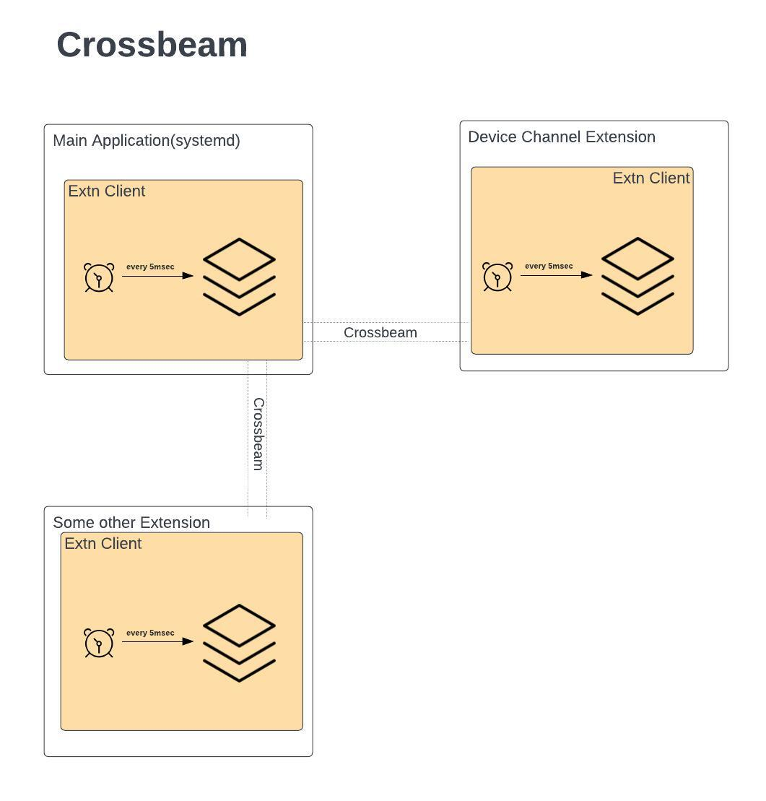
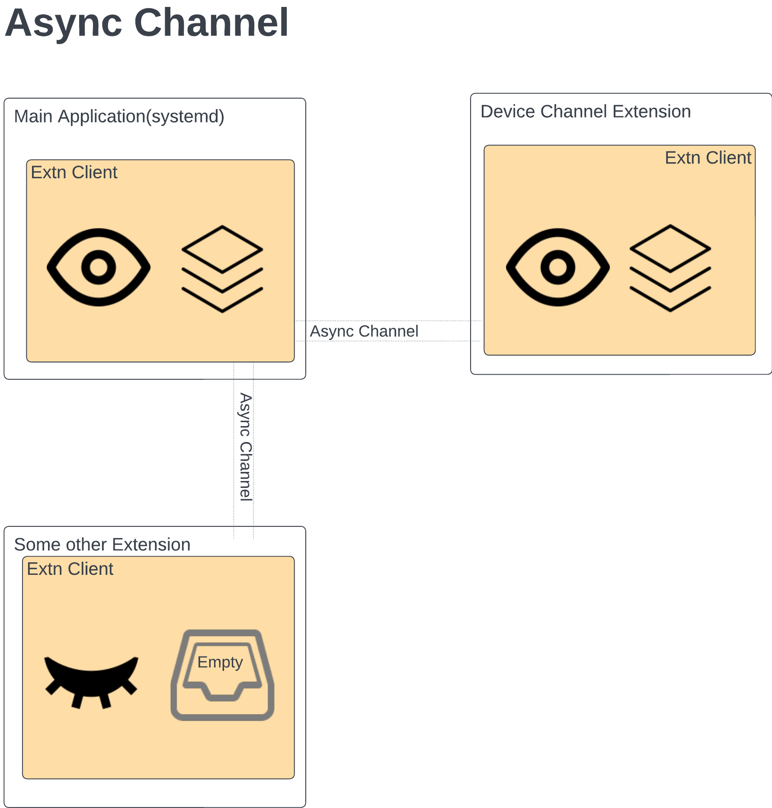
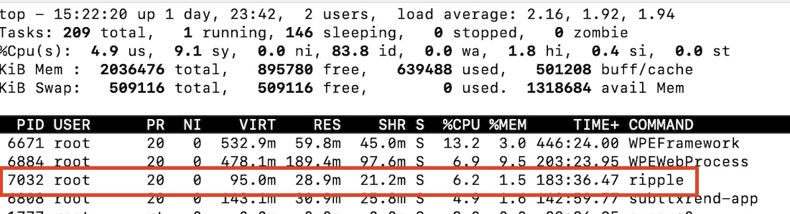
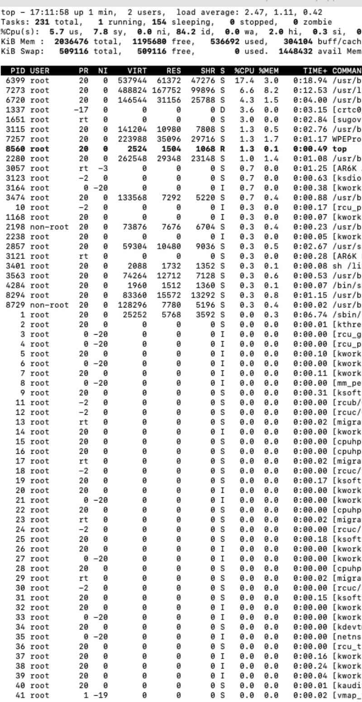
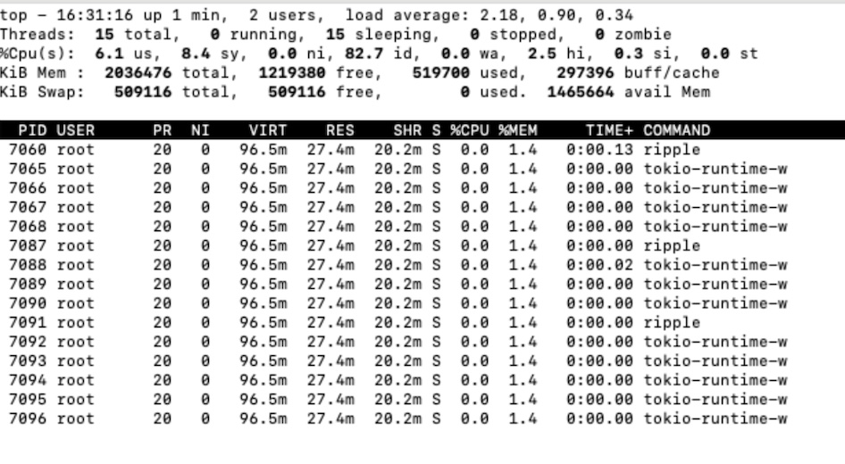
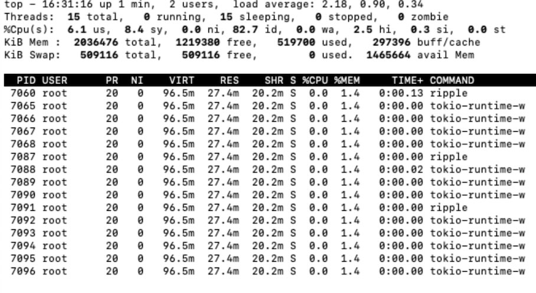
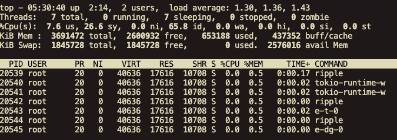

# Replacing Crossbeam with Async Channel

## Status

__**Proposed**__

## Context

## Glossary
`Main`: Ripple `Main` application which starts the Ripple platform.

`Extension`(alias `Extn`): Runtime dynamically linked libraries built using Ripple SDK, `Main` loads these libraries during startup to offer enhanced capabilities.

`FFI` a.k.a Foreign Functional Interface for a given executable(Main) to interact with other dynamic shared libraries(Extns).

`IEC`: Inter Extn Communication implemented through the `ExtnClient`.

`MPMC`: Multiple Producer and Multiple Consumer model of communication between multiple components like Main and Extension(s)

`Crossbeam`: [Rust crate](https://docs.rs/crossbeam/latest/crossbeam/index.html) which support MPMC but with synchronous support.

`Async Channel`: [Rust crate](https://docs.rs/async-channel/latest/async_channel/) which support MPMC but with asynchronous support.

`Tokio Runtime` : [Tokio Runtime](https://docs.rs/tokio/latest/tokio/runtime/index.html) is a asynchronous scheduler which performs series of async tasks through concept called green threads. In Ripple we use Tokio runtime in `Main` and in `Extensions`. 

`Tokio Task` : [Tokio Task](https://docs.rs/tokio/latest/tokio/#working-with-tasks) are lightweight, non-blocking operations which are performed within a Tokio runtime. 
Inside a Tokio Runtime each of the async operation is executed inside a Tokio Task, Runtime has a queue for tasks and they are executed based on Thread availability.

#### How did we get here?
At the early stages of Ripple development, there was a need for a reliable library which supports `MPMC` and also FFI compatible between Main and Extensions.
Only problem with cross beam is it is synchronous, and it cannot directly run alongside other asynchronously running operations. With all the other priorities this implementation was marked for a deprioritized for other efforts.

Below diagram depicts the IEC backbone between Main process and the Extensions using `Crossbeam`

## Problems
Current Implementation of the IEC with crossbeam raised the following concerns.
For easier linking and references we are going to denote the problems with a `P: [A-Z](n)` notation.

### [P:A]  High CPU usage
Constant evaluations(5msec) of Crossbeam channel to look for new messages increases the overall CPU usage for Ripple.

### [P:B]  No Idle Time
There is no idle time between Main and Extensions this would become an issue on lower end devices.

### [P:C]  Exponential Scalability Problem
This problem increases as more extensions are added and this design is not scalable.

### [P:D] Lack of Tokio Runtime Customization leading to Memory over allocation
Current Ripple sdk doesnt support many features which are available in Tokio runtime. Tokio supports
1. Naming a thread
2. Setting Number of worker threads
3. Setting Stack size for a given thread

## Solution

### A1 Async Channel

Below diagram depicts the IEC backbone between Main process and the Extensions using `Async Channel`

Async channel implementation uses existing Tokio runtime within Main and Extensions. Given Async Channel uses threads it sends a wake signal when a message arrives.

#### Low CPU usage solves [P:A] and [P:B]
Ripple with crossbeam IEC when idle was consuming 6.2% of total CPU.

Below is screenshot from a device running Ripple with IEC Crossbeam in an idle state.
Ripple is the 3'rd from the top of processes running on the device during Idle state.

Here is the screenshot with IEC of Async Channel in an idle state

Ripple doesnt even exist on the top list with the `Async Channel` change.
We had to pull the Ripple process out based on `PID`` to see whats happening and Ripple was consuming 0% CPU when idle.

Afyer `Async Channel` implementation it was also evident that the number of threads and memory allocation were also configured incorrectly in Ripple.

### A2 Better Tokio Runtime management
`ExtnUtils::get_runtime()` method can now help developers standardize their runtime creation and provide customization support.

#### Thread naming
Threads are named properly using this `ExtnUtils::get_runtime()` utility each thread will be mapping back to `Extension` to provide better tracking.

#### Reducing the worker threads solves [P:D]
Ripple doesnt need more than a single worker thread in its extensions.
Unfortunately runtime spawns 4 worker threads per Runtime by default. However Tokio uses the `TOKIO_WORKER_THREADS` environment variable to let apps configure the number
threads required by the application.

Ripple extension is designed to expect a single thread per Tokio runtime, any extension requiring more than a thread needs a better implementation.
Given most of the ripple operations are a pass through, an extension should not need more than 1 worker thread to do its operations.

With the introduction of the `Async Channel` most of the time Ripple will be asleep and will only wake up on a Firebolt operation.

Therefore Ripple now restricts the number of worker thread to 1 when using the sdk utility.

#### Lesser Stack allocation per thread solves [P:D]
Tokio also supports configuring stack allocation per thread. 

Below default allocations are defined in the `ExtnUtils::get_runtime()` this can also be configured using environment variables.

| Size      | Allocation in Kilo Bytes | Environment Variable|
| ----------- | ----------- | ----------- |
| Min      | 512       |  RIPPLE_STACK_SIZE_MIN_IN_KB |
| Medium   | 1024        | RIPPLE_STACK_SIZE_MEDIUM_IN_KB | 
| Max      | 2048        | RIPPLE_STACK_SIZE_MAX_IN_KB |

Below are screenshots of before and after `Tokio Runtime` changes.

Before

After

### A3 Removing Clippy Large Enum variant solves [P:D]

After integrating with Clippy we got errors related to `large-enum-variant`. Clippy suggested to use Box<Values> in case of variance between members of an enum. Clippy have claimed that this lint might be [incorrect](https://rust-lang.github.io/rust-clippy/master/index.html#/large_enum_variant). Removing this change also had a huge impact in terms of Memory allocations.

## Impact

### Less CPU Utlization

Ripple used to be in the top 5 list in the processes running on a device even during idle state. 

Now ripple is not even on the list during idle state with the introduction of `Async Channel` making it more viable for devices with lower memory requirements.

### Better Memory Utilization

Overall memory allocation and usage has reduced below.

| Term      | Before Performance | After Performance|
| ----------- | ----------- | ----------- |
| Threads | 15 | 7 |
| Virtual Memory | 96.5 Mb | 39 Mb | 
| Reserved Memory | 27.4 Mb | 17.6 Mb |
| Shared Memory | 20.2 Mb | 10.4 Mb|
| Private RSS | 24.8 Mb | 17.3 Mb| 
| Shared RSS | 12.4 Mb | 1.6 Mb|

