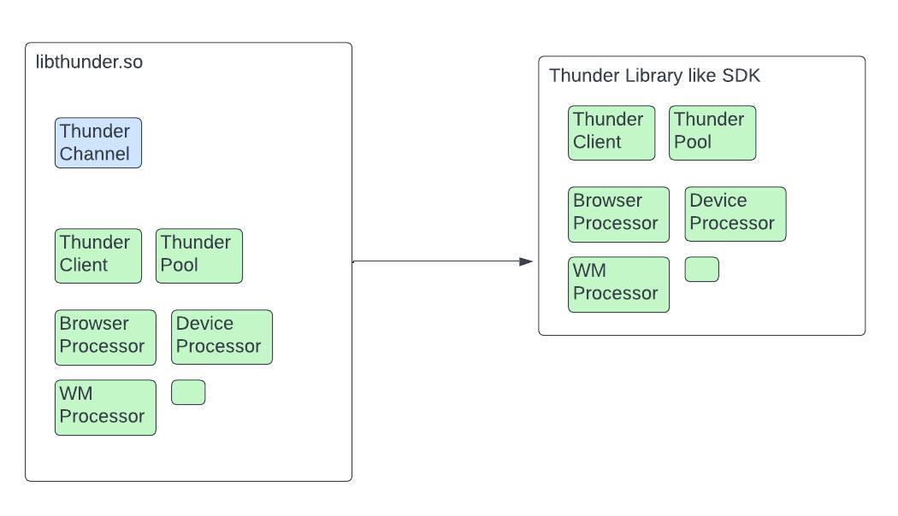
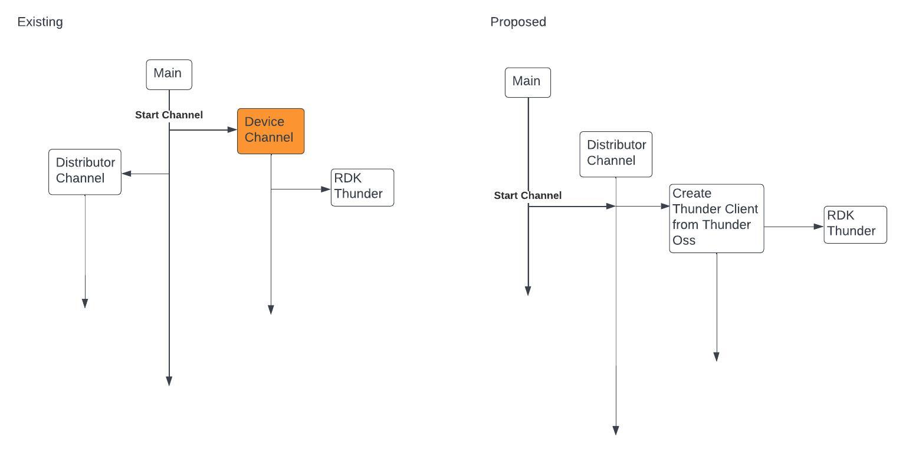
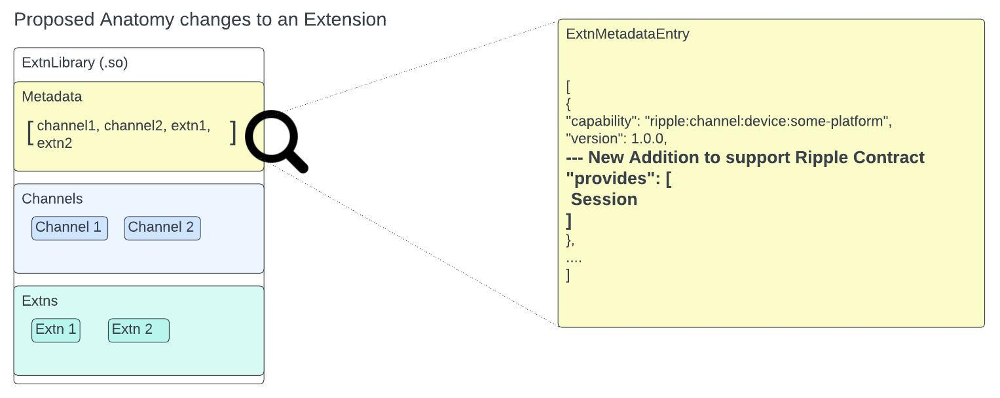
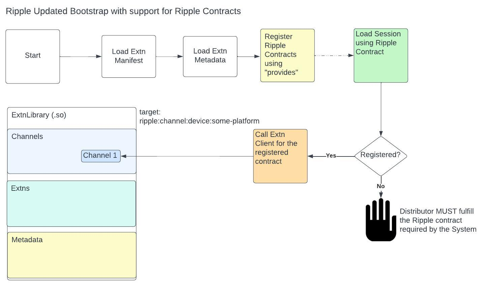
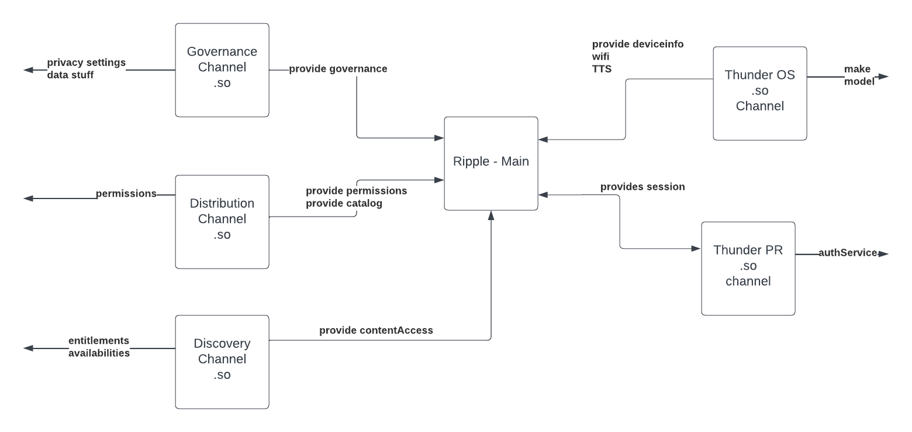

# Building Extensions with Contract Fulfillments

## Status

__**Pending**__

## Context

### Glossary
`Main`: Ripple `Main` application which starts the Ripple platform.
`Extension`(alias `Extn`): Runtime dynamically linked libraries built using Ripple SDK, `Main` loads these libraries during startup to offer enhanced capabilities.
`ExtnCapability` : Current implementation of identifying and encapsulating a function of a given extension. ExtnCapability has an anatomy of `ripple:[channel/extn]:[ExtnClass]:[service]`
`ExtnClass` : Classifies a given capability by mapping it to a functional Ripple unit like Device, Launcher, Distributor etc
`IEC`: Inter Extn Communication implemented through the `ExtnClient`

### Problems
Current Implementation of the Ripple Extensions have raised the following concerns.
For easier linking and references we are going to denote the problems with a `P: [A-Z](n)` notation. 
#### P: A 
Better extension bundling strategies for scalability and standardization of the platform.
#### P: B
Capabilities are not well defined and overloaded with both identification and `ExtnClass` mapping. 
##### P: B1 
Arbitrary capabilities defined by each extensions leading to ambiguity, security and other long term issues.
##### P: B2
Open-ended design of the capabilities which do not enforce distributors to implement required capabilities within the Ripple platform.
#### P: C1
Non robust implementation of proprietary Device Extensions which have a ambigous input and output schema definitions leaving room for scalability, standardization and security issues.
#### P: C2
Proprietary Device Extensions having to make multiple hops to reach the device channel and restricting Distributor developers with their custom implementation.

## Approaches
There were many approaches discussed to tackle this problem
For easier linking and references we are going to denote the approaches with a `A: n` notation. 

### A: 1
Moving `device/channel` cargo workspace from an `Extn` to a library and move the `Device` connection layer into the distributor. 
Current version of ripple has 3 layers 
1. `Main` - starts `Device` and `Distributor`
2. `Device` - which connects to the device using a channel for device operations.
3. `Distributor` - which encapsulates the distributor operations.

This approach requires `device/thunder` to become a crate library instead of an extension library.

This approach tries to move the `Device` layer and move it into the `Distributor`.

There are multiple issues with this approach first off separation of concerns between a `Distributor` and `Channel` will be removed.

`Thunder` as a library crate still feels very appropriate to be used as a viable solution.

### A: 2
Uses Ripple Contract as a mechanism to deal with ambiguity and enforcement.
#### What is a Ripple Contract? 
A concrete unit of work expected to be available through extensions. These contracts are not bound to a particular ExtnClass or ExtnType. Depending on a distributor implementation this contract can be fulfilled from 
a. Device Extn
b. Distributor Extn/Channel
c. Combination of a Device + Distributor Extensions

#### What is contract fulfillment?

Ripple mandates set of contracts to be fulfilled by the Extn(s) on load. This helps `Main` to identify, catalogue and apply permissions within IEC. If contract fulfillments are not met by Extn(s) it leads to a fatal bootstrap error.

#### Difference between ExtnCapability and RippleContract
| ExtnCapability        | RippleContract           | 
| ------------- |-------------| 
| Extension Identifier which classifies itself based on ExtnType which can be Channel or Extn and ExtnClass which classfies it further on how its applied. Finally it has an open ended service which is defined as per the Extn manifest.| Ripple Capability are contracts required by the Ripple Platform which are mandated to be implemented by the Distributor through their extensions. These are pre defined and will lead to bootstrap errors when not implemented.|
|Open Ended Enumeration like `ripple:extn:device:[session]`, `ripple:extn:distributor:[session]` | Closed Enumeration like Session|
|Has a predefined role and lifecycle to run within certain expectations based on it ExtnClass and ExtnType|Needs to be registered by the Extensions and lifecycle will be based on the registered extension|
|Supports Main in understanding the routing of a given extension during the Extension Client processes| Supports Main in identifying the extension which registered for the Ripple Capability|

#### How an Extn would include Ripple Contract
Every library has its symbols defined as `ExtnMetadataEntry`, in this new approach this entry will contain a `provides` value which denotes the contract.

#### How does ripple enforce these contracts?

Overall this design addresses major concerns and can be used for some of the Problems with `ExtnCapability`

## Decision

Following decision drivers are proposed for solution

### Extension libraries will only provide Builders
Solves [P: A](#p-a)
Current implementation of `Extn` has a one to one mapping with a channel or extn. This doesnt scale as distributors would be expected to create multiple repos for fulfilling their contracts.

Builders will be of many types depending on their purpose
1. ChannelBuilder - Builds `ExtnChannel`
2. JsonRpseeBuilder - Builds rpc extensions for Firebolt gateway

There could be may more such builders in near future.

### Rename ExtnCapability to ExtnId
Solves [P: B](#p-b)
As explained [here](#difference-between-extncapability-and-ripplecontract), `ExtnCapability` is actually playing the role of identifier for an extension with the open-ended service. Overloading this with the ripple capability was the reason many of the above problems have araised.

With this change we have a better purpose and clarity for `ExtnId` where it will be used for 
1. IEC to discover and delegate messages across the Extn spectrum
2. Applying permissions based on the `ExtnManifest`

### Introduce RippleContract
Solves [P: B1](#p-b1), [P: B2](#p-b2) and [P: C1](#p-c1)

This [section](#a-2) covers these problems in detail

### Create Thunder Library crate
Solves [P: C2](#p-c2)

This was covered as the outcome for [A: 1](#a-1).Thunder library crate can be used by Distributor developers to create a Proprietary channel with their own thunder connection. This removing the need for Open ended capabilities or contracts causing [P: B1](#p-b1).

## Impact
There are many impacts to the Ripple code with this proposal, they are listed below:
### Bootstrapping to Builders vs Channels

Current implementation of Ripple uses these below Channels during bootstrap in `ExtnState`
1. `Device` Channel
2. `Launcher` Channel

Proposal expects Channel to be available from a builder, so the current bootstrap process needs to be updated to use `ExtnChannelBuilder` and then build `ExtnChannel`(s)

Proposal expects Device channel to be plural in nature to support `Proprietary` Extns which can certainly be device channels as well.

So during `LoadExtensionMetadataStep` in bootstrap `Main` will identify the `DeviceChannel(s)` and keep them in a separate vector.

All other channels will be in a separate vector.

Bootstrap would start the `DeviceChannel`(s) and then start all of the other channels.

### Extn Client routing using Contracts and ExtnId

`ExtnClient` currently uses the top level `ExtnClass` and `ExtnType` to identify a Crossbeam sender to pass on the message to the extension. For eg `ripple:class:device:thunder` it uses the key `class:device` to store a value of Crossbeam Sender. 

This logic would now change to 2 levels of mapping
1. Map<ExtnId,CrossbeamSender<CExtnMessage>> - To store the Extn Id to cross beam sender mapping.
2. Map<Contract,ExtnId> - To help reduce duplication of CrossbeamSender across multiple redundant key values for similar contracts like device:info, device:windowmanager and other OSS RDK services

### Extn Payload provider to use Contracts

`ExtnPayloadProvider` would change the method signature to fulfillment of contract rather than discovery of ExtnCapability. 

For eg when a Request processor is added to a client. Client will send this `RippleContract` as a `ContractStatus` back to `Main`. This will help `Main` enforce contracts and provide fatal errors.

### Thunder channel extension will use Thunder Library crate

Reusable code like `ThunderClient`, `ThunderPool` and `ThunderState` bootstrap logic will be moved into a reusable library. `device/thunder` will only have the processor and `ExtnChannel` logic such that a distributor can reuse all the components to quickly add support for their own proprietary Thunder extensions.

### Launcher will stop calling app launch on start
Launcher will be started along with other deferred `Channels` after the Device `ExtnChannel` is started up. Current code of launcher will be updated to not start the launching of the app on startup and it will rather wait for an event from `Main` to start the launch process.

Applying all the above changes Ripple architecture would look something like below.
