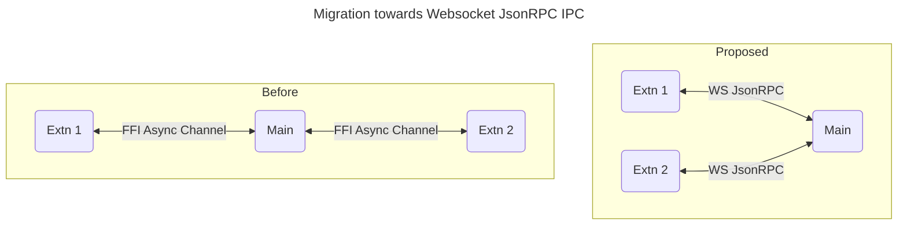
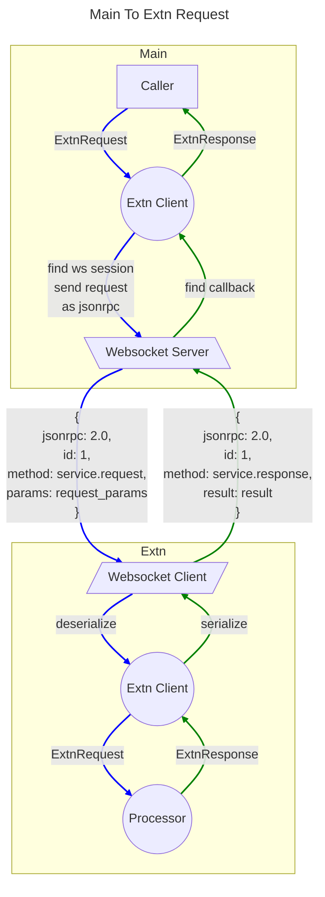
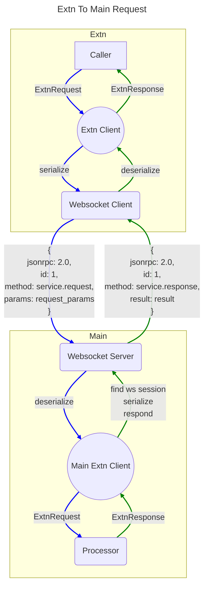

# Websocket based Extension IPC 

## Overall Design

Below diagram illustrates the transition from a traditional FFI-based asynchronous communication model to a WebSocket-based JSON-RPC IPC model. 

### Before:
- Extensions communicate with the Main system using FFI Async Channels.
- The Main system acts as a central hub, relaying messages between extensions.

### Proposed:
- Extensions directly communicate with the Main system using WebSocket JSON-RPC.
- This approach simplifies communication by establishing direct WebSocket connections between the Main system and each extension.

The new model enhances modularity, scalability, and simplifies the communication protocol.

## Main to Extn Request Response
The diagram illustrates the interaction between the Main system and the Extension system during a request-response cycle:

1. **Main System**:
    - A `Caller` sends an `ExtensionRequest` to the `Main Extension Client`.
    - The `Main Extension Client` locates the WebSocket session and forwards the request as a JSON-RPC message to the `WebSocket Server`.

2. **Extension System**:
    - The `WebSocket Server` sends the JSON-RPC request to the `WebSocket Client` in the Extension system.
    - The `WebSocket Client` deserializes the request and passes it to the `Extension Client`.
    - The `Extension Client` forwards the request to the `Processor`, which processes it and sends back an `ExtensionResponse`.
    - The `Extension Client` serializes the response and sends it back to the `WebSocket Client`.

3. **Response Flow**:
    - The `WebSocket Client` sends the JSON-RPC response back to the `WebSocket Server`.
    - The `WebSocket Server` locates the callback and forwards the response to the `Main Extension Client`.
    - The `Main Extension Client` sends the `ExtensionResponse` back to the `Caller`.

The flow is visually represented with blue links for request paths and green links for response paths.

## Extn to Main Request Response
## Extn to Main Request Response

The diagram illustrates the interaction between the Extension system and the Main system during a request-response cycle:

1. **Extension System**:
    - A `Caller` sends an `ExtnRequest` to the `Extension Client`.
    - The `Extension Client` serializes the request and forwards it to the `WebSocket Client`.
    - The `WebSocket Client` sends the request as a JSON-RPC message to the `WebSocket Server`.

2. **Main System**:
    - The `WebSocket Server` deserializes the JSON-RPC request and forwards it to the `Main Extension Client`.
    - The `Main Extension Client` processes the request by sending it to the `Processor`.
    - The `Processor` generates an `ExtnResponse` and sends it back to the `Main Extension Client`.
    - The `Main Extension Client` serializes the response and sends it back to the `WebSocket Server`.

3. **Response Flow**:
    - The `WebSocket Server` sends the JSON-RPC response back to the `WebSocket Client`.
    - The `WebSocket Client` deserializes the response and forwards it to the `Extension Client`.
    - The `Extension Client` sends the `ExtnResponse` back to the `Caller`.

The flow is visually represented with blue links for request paths and green links for response paths.

